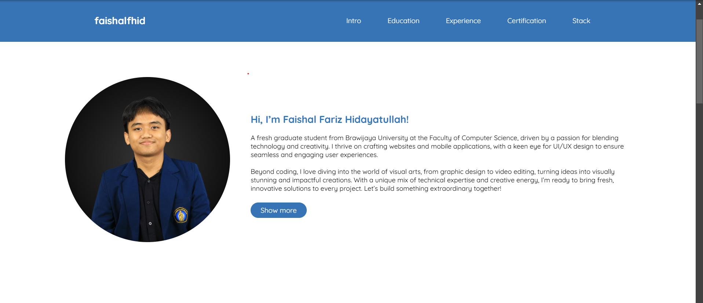

# Portfolio Website

Welcome to my personal portfolio website! This website showcases my education, experience, certifications, and technology stack.

## 🚀 Features
- Responsive Design
- Smooth Scrolling Navigation
- Interactive UI with JavaScript
- Organized Content Sections (Intro, Education, Experience, Certification, Tech Stack)
- Social Media Links

## 📂 Project Structure
```
📦 portfolio-website
├── 📂 assets
│   ├── 📂 image
│   └── 📂 styles
├── 📜 index.html
├── 📜 assets/styles/style.css
├── 📜 script.js
```

## 🛠️ Technologies Used
- **HTML5** - Structure of the webpage
- **CSS3** - Styling and Layout
- **JavaScript** - Interactive functionality
- **Google Fonts** - Custom typography
- **Font Awesome** - Icons for social links

## 🔧 Installation
To run this project locally:
1. Clone the repository:
   ```sh
   git clone https://github.com/faishalfhid/portfolio-website.git
   ```
2. Open the `index.html` file in your browser.

## 📸 Screenshots


## 🔗 Live Demo
Check out the live version of my portfolio here: [Portfolio Website](https://www.faishalfhid.my.id/)

## 🤝 Connect With Me
- 📧 Email: [faishalfh1@gmail.com](mailto:faishalfh1@gmail.com)
- 💼 LinkedIn: [linkedin.com/in/faishalfariz](https://www.linkedin.com/in/faishalfariz/)
- 🐱 GitHub: [github.com/faishalfhid](https://github.com/faishalfhid/)
- 📷 Instagram: [instagram.com/faishalfhid](https://www.instagram.com/faishalfhid/)

---
Made with ❤️ by **Faishal Fariz Hidayatullah**

